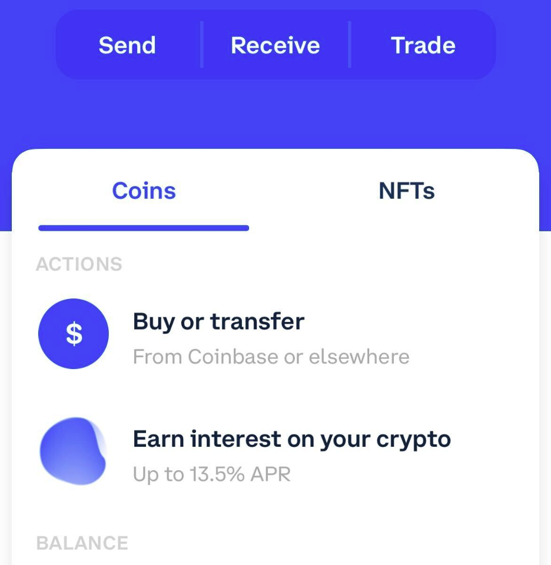
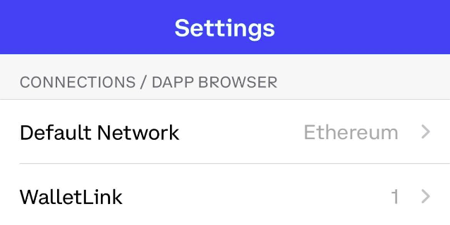
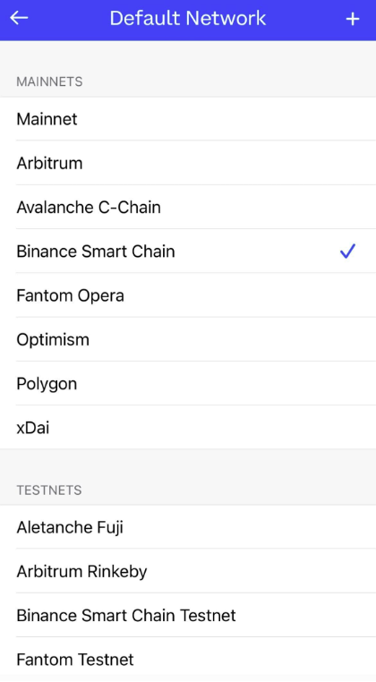
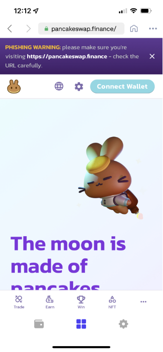
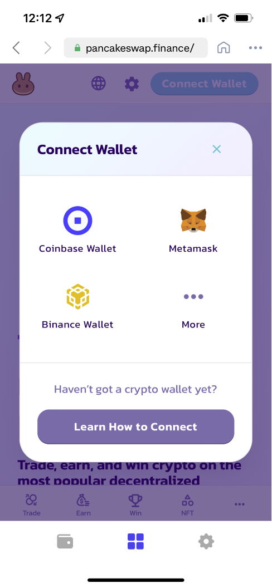
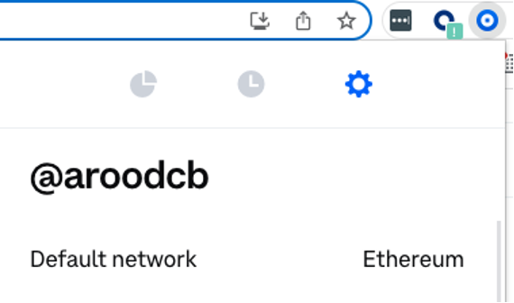
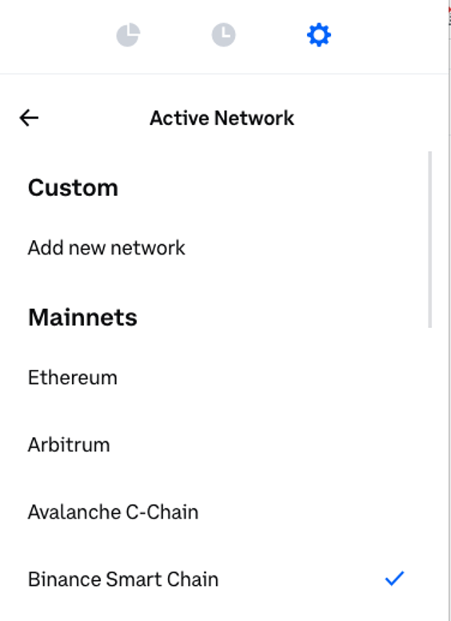
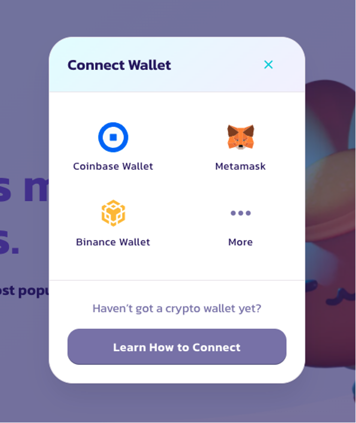

# 将你的钱包连接到 PancakeSwap

你已经创建了钱包并获得了 BEP20 代币，现在只需将你的钱包与 PancakeSwap 连接，就可以开始使用了！

请查看下方步骤，了解如何将我们推荐的各款钱包连接到 PancakeSwap。

## 智能手机/移动端



.png>)

要连接 Trust Wallet，请按照下方步骤操作。请注意，Android 和 iOS 设备的步骤并不相同！

#### Android

1. 打开 Trust Wallet，点击屏幕底部的 **DApps** 按钮。

.png>)

1. 向下滚动到 "Popular"，点击 "PancakeSwap"。你也可以在 "Exchanges" 中找到它。

.png>)

1. 一个带有 PancakeSwap 标志和一些信息的新页面将会打开。点击 **Connect** 按钮。

.png>)

1. PancakeSwap 将会打开。如果你在右上角看到 **Connect** 按钮，点击它，然后从列表中点击 **Trust Wallet**。


如果你发现自己在第 4 步无法连接，请返回 DApps 菜单并重新找到 "PancakeSwap"。使用 "History" 部分中的 "Pancake Swap" 可能会导致同样的问题。


#### iOS

要通过 iOS 连接到 PancakeSwap，Trust Wallet 准备了一份关于使用 WalletConnect 的详细指南。

请阅读 [Trust Wallet 关于通过 WalletConnect 连接到 PancakeSwap 的指南](https://community.trustwallet.com/t/using-walletconnect-to-access-pancakeswap/212307)。

#### **资源**

[**下载 Trust Wallet**](https://trustwallet.com)（自动检测设备）\
[**Trust Wallet 设置指南**](https://www.binance.com/en/blog/421499824684901157/how-to-set-up-and-use-trust-wallet-for-binance-smart-chain)



 (3).png>)

要将 MetaMask 连接到 PancakeSwap，请按照下方步骤操作。

#### Android 和 iOS

1. 打开 MetaMask，点击左上角的**汉堡图标**。

.png>)

1. 在菜单中点击 **Settings**。

.png>)

1. 在 Settings 菜单中，点击 **Network**。

.png>)

1. 点击底部的 **Add Network** 按钮。

.png>)

1. 在打开的页面上，输入以下详细信息：

**Network Name:** BNB Smart Chain\
**RPC Url:** [https://bsc-dataseed.binance.org](https://bsc-dataseed.binance.org)\
**Chain ID:** 56\
**Symbol:** BNB\
**Block Explorer URL:** [http://bscscan.com](http://bscscan.com)

1. 确认输入新网络后，返回汉堡菜单并点击 **Browser**。

.png>)

1. 在搜索栏中输入 "PancakeSwap" 并开始搜索。排名第一的结果将是 PancakeSwap 交易所。点击进入。
2. 你的钱包会要求你连接。点击 **Connect** 以连接到 PancakeSwap。

.png>)

#### 资源

[**下载 MetaMask**](https://metamask.io/download.html)（自动检测设备）\
[**MetaMask 设置指南**](https://academy.binance.com/en/articles/connecting-metamask-to-binance-smart-chain\))




1. 打开 Coinbase Wallet，点击右下角的**设置图标**。\
   \
   
2. 在 Settings 菜单中，点击 **Default Network**。\
   
3. 从网络选项列表中选择 **Binance Smart Chain**。\
   
4. 选择 Binance Smart Chain 网络后，点击应用底部中间的**浏览器图标**。\
   \
   
5. 在搜索栏中输入 "PancakeSwap.finance" 并开始搜索。\
   
6. 点击 **Connect** **Wallet** 以连接到 Coinbase Wallet。\
   

#### **资源**

[**下载 Coinbase Wallet**](https://coinbase-wallet.onelink.me/q5Sx/fdb9b250) **（自动检测设备）**

[**Coinbase Wallet 设置指南**](https://www.coinbase.com/wallet/getting-started-mobile)



 (3).png>)

Token Pocket 是一款加密货币管理应用，原生支持众多加密货币网络。它还提供桌面应用程序。

#### **Android 和 iOS**

1. 点击主屏幕底部的 **Discover** 按钮。

.png>)

1. 你将看到一个 DApp 浏览器页面打开。在 "Recommended" 下，找到并点击 **PancakeSwap** 按钮。如果你在 Recommended 下看不到 PancakeSwap，也可以在 "BSC" 下找到它。

.png>)

1. 一个窗口将会打开，提示你即将打开一个第三方 DApp。点击 **I got it**，你将被带到与你的钱包连接的 PancakeSwap 网站。

.png>)

**资源**\
[**下载 Token Pocket 应用**](https://www.tokenpocket.pro/en/download/app)（自动检测设备）\
**Token Pocket 移动端设置指南**



.png>)

SafePal 同时提供软件钱包和硬件钱包。该钱包易于安装和创建，并且开箱即可支持 BEP2 (Binance Chain) 和 BEP20 (BNB Smart Chain)。

#### **Android 和 iOS**

1. 点击主屏幕底部的 **4 个方块**图标按钮。

.png>)

1. 你将看到一个 DApp 浏览器页面打开。在 "DeFi" 下，找到并点击 **PancakeSwap** 按钮。如果你在 DeFi 下看不到 PancakeSwap，也可以在 "BSC" 下找到它。

.png>)

1. 一个窗口将会打开，提示你即将打开一个第三方 DApp。点击 **Confirm**，你将被带到与你的钱包连接的 PancakeSwap 网站。

.png>)

**资源**\
​[**下载 SafePal**](https://safepal.io/download)（自动检测设备）\
[**SafePal 设置指南**](https://blog.safepal.io/binance-smart-chain-x-safepal/)



## **桌面/网页浏览器钱包**



 (3).png>)

#### Chrome 和 Firefox

1. 打开 MetaMask，点击顶部的**网络选择器**。默认情况下它会显示 "Ethereum Mainnet"。向下滚动并点击 **Custom RPC**。

.png>)

1. 一个窗口将会打开。输入以下详细信息。

**Network Name:** BNB Smart Chain\
**New RPC URL:** [https://bsc-dataseed.binance.org](https://bsc-dataseed.binance.org)\
**Chain ID:** 56\
**Currency Symbol (optional):** BNB\
**Block Explorer URL (optional):** [http://bscscan.com](http://bscscan.com)

.png>)

1. 确保你输入的所有内容都正确，然后点击 **Save**。BNB Smart Chain 现在将成为你的网络选项之一。

.png>)

1. 访问 [PancakeSwap 网站](https://pancakeswap.finance)。在右上角你会看到 **Connect** 按钮。点击它。

 (1).png>)

1. 一个窗口将会出现，要求你选择要连接的钱包。点击 **MetaMask**（它是列表中的第一个选项）。

.png>)

#### 资源

[**下载 MetaMask**](https://metamask.io/download.html)（自动检测浏览器）\
[**MetaMask 设置指南**](https://academy.binance.com/en/articles/connecting-metamask-to-binance-smart-chain)



.png>)

#### Chrome 和 Firefox

1. 打开 Binance Chain Wallet，点击顶部的网络选择器。默认网络将是 Binance Chain。从列表中选择 **BNB Smart Chain**。

.png>)

1. 访问 PancakeSwap 网站。在右上角，点击 **Connect**。

 (1).png>)

1. 一个窗口将会出现，要求你选择要连接的钱包。点击 **Binance Chain Wallet**（它在列表中较靠下的位置）。

.png>)

#### 资源

[**下载 Binance Wallet**](https://www.binance.org/en)（自动检测浏览器）\
**Binance Wallet 设置指南**




1. 打开 Coinbase Wallet，点击右上角的 **Settings** 图标。默认情况下它会将 "Ethereum Mainnet" 显示为默认网络。\
   
2. 点击 **Default Network** 并选择 **Binance Smart Chain**\
   
3. Binance Smart Chain 现在将成为你的默认网络。
4. 访问[pancakeswap.finance](https://pancakeswap.finance)，在右上角你会看到 **Connect** 按钮。点击它。\
   
5. 一个窗口将会出现，要求你选择要连接的钱包。点击 **Coinbase Wallet**（它是列表中的第一个选项）。\
   

#### **资源**

[**下载 Coinbase Wallet**](https://chrome.google.com/webstore/detail/coinbase-wallet-extension/hnfanknocfeofbddgcijnmhnfnkdnaad?hl=en\&authuser=0)（仅限 Chrome）

[**Coinbase Wallet 设置指南**](https://www.coinbase.com/wallet/getting-started-extension)



 (3).png>)

#### 桌面应用程序

1. 当你打开应用程序时，DApps 应该是默认页面（如果不是，请点击进入 DApps 页面）。
2. 在页面中间偏下的位置，你会看到一个可供选择的网络列表。点击 **BSC**。

.png>)

1. 在 BSC DApp 列表中，你会找到 PancakeSwap 链接。点击一个 **PancakeSwap** 链接。

.png>)


确保你不要选择 "PancakeSwap data analysis" 选项。如果选择了，你将无法连接。


1. 你的浏览器将打开一个 PancakeSwap 标签页并尝试连接到 Token Pocket。


你无法在同一个网页浏览器中同时使用 MetaMask 和 TokenPocket 进行连接。如果你在桌面计算机上使用 TokenPocket，请确保使用一个未安装 MetaMask 插件的网页浏览器。


#### 资源

[**下载 Token Pocket 桌面钱包**](https://www.tokenpocket.pro/en/download/pc)（MacOS 或 Win64）\
**Token Pocket 桌面设置指南**




**请记住——在任何情况下，你都绝不应该将你的私钥或恢复短语透露给任何人。**

