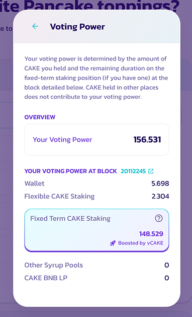

# veCAKE

### [什么是 veCAKE？](what-is-vecake.md#what-is-vecake)

### [veCAKE 是如何计算的？](../../../earn/earn-faq/cake-staking-faq/vecake-faq.md#id-52f27118-bbf3-448b-9ffe-e9e1a9dd97ef)

### 如何查看 veCAKE 数值？

如果你正在投票，可以在"Confirm Vote"窗口中点击">"按钮，在投票权明细中找到 vCAKE 的数值。

如果你正在发起社区提案，可以点击"Actions"面板底部的"Check your voting power"来查看你的投票权。
