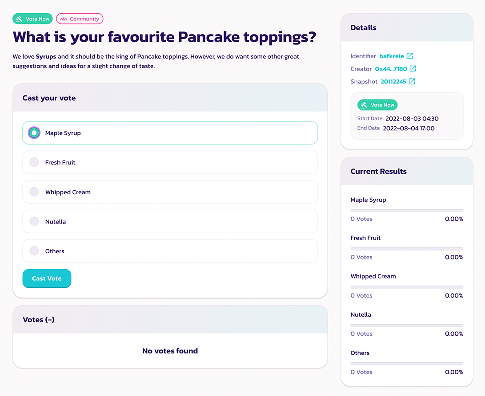
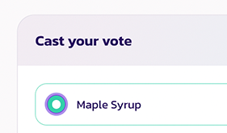
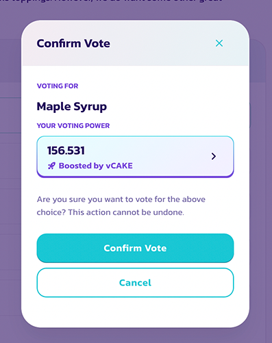
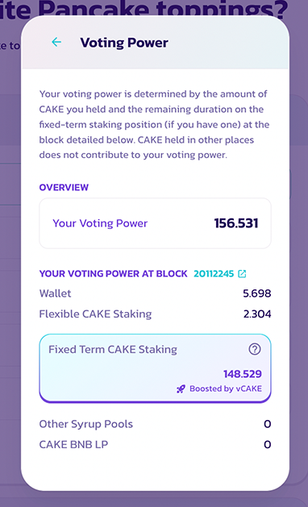
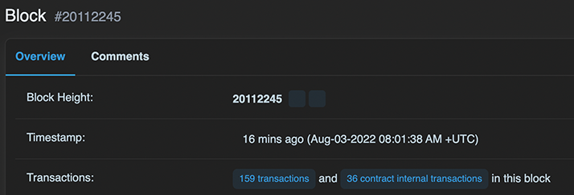

# 如何投票

<figure><figcaption></figcaption></figure>

参与治理投票非常简单，并且完全**免费**。 您甚至不需要支付燃料费！ 详细了解如何投票、快抓住下一个提案并行使您的投票权吧！

### 如何投票

#### **导航到投票提案界面**

每当我们发布新提案时，我们会在各个[社交渠道](../../../sheng-tai-xi-tong-he-zuo-huo-ban-guan-xi/contact-us/telegram.md)发布投票界面的链接。 因此，请务必关注我们的社交渠道以获取最新的消息。 或者，您可以访问 [PancakeSwap 的本地投票门户](https://pancakeswap.finance/voting?\_gl=1\*pc8o0h\*\_ga\*MTUzNDEzNDQxMy4xNjAwNzkzNDM4\*\_ga\_334KNG3DMQ\*MTYwNDMwMTk4Ni42MC4xLjE2MDQzMDM3MDIuMA..#/)以浏览列表中的提案。 如果您没有看到该提案，它可能位于“Soon”选项卡中。

#### 阅读提案并选择您支持的选项

<figure><figcaption></figcaption></figure>

在提案页面上， 您会看到：

* 提案内容&#x20;
* 投票的选项&#x20;
* 提案的详细信息
* 提案的一些细节例如快照区块及投票窗口&#x20;
* 最新的投票结果&#x20;
* 参与投票的名单&#x20;

仔细阅读提案，然后单击您支持的投票选项。

<figure><figcaption></figcaption></figure>

#### 确认并投票

<figure><figcaption></figcaption></figure>

确认所有详细信息并单击“确认投票”，然后在您的钱包中确认以签署消息。&#x20;

好了，您刚刚成功完成了投票。

### 如何检查投票细节



在正式投票之前，您将看到一个“确认投票”窗口。

<figure><figcaption></figcaption></figure>

在此窗口中，您可以仔细检查以下项目：

* 您选择的投票选项&#x20;
* 您的投票权

如果您不确定可用投票权是如何计算的，请单击“>”以显示详细的内容。

<figure><figcaption></figcaption></figure>

请注意，只有存放在以下地方的CAKE 才会计入投票权：

* 钱包里&#x20;
* 灵活 CAKE 质押池（包括 CAKE 池和侧池）
* 锁仓 CAKE 质押池（经 vCAKE 加成！）&#x20;
* 其他糖浆池（其他项目提供）&#x20;
* CAKE/BNB LP

存放在其他地方的 CAKE 不计入您的投票权。



#### 检查快照的区块时间

<figure><figcaption></figcaption></figure>

可用投票权的计算是基于快照区块时间的。 因此，在提案发布后购买或存入更多 CAKE 不会增加您对此提案的投票权。&#x20;

如果您想知道快照区块的确切时间。 只需单击区块号并在 BscScan 页面上查找相应的时间戳。

<figure><figcaption></figcaption></figure>



